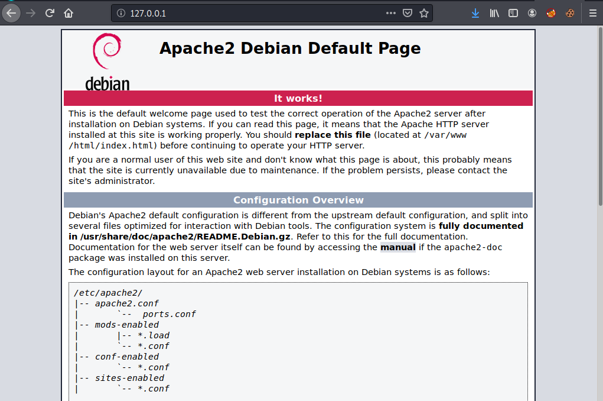
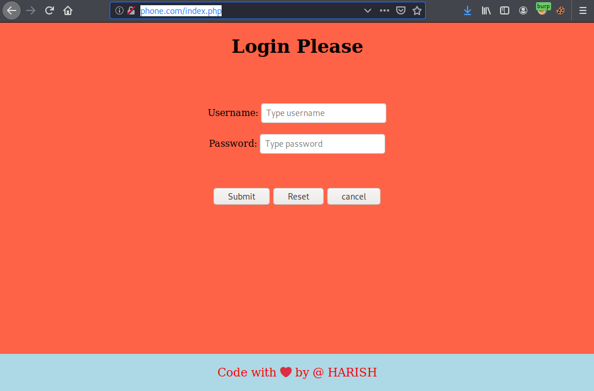
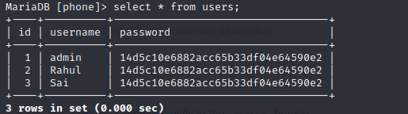
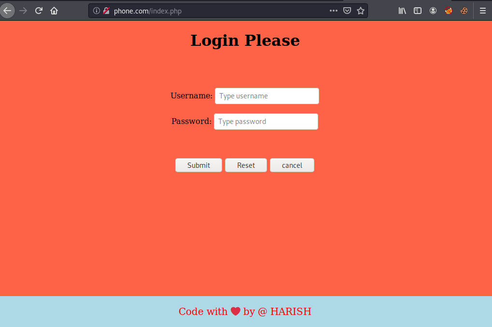

# Creating Database MYSQL, Web Server Apache2 and Content by PHP to enable a server to host dynamic websites and web apps. 

### step 1:

In Linux (kali) operating system make sure its an updated or upgraded version, If not,

> $ sudo apt update 

Then move to 

##### installation of Apache2 Web server.

Check for Apache2 if not then install using below command.
>sudo apt install apache2

We can check status using below command 
>sudo service apache2 status

we can restart by using below command if already install but its status is Dead.
>sudo service apache2 start

We can now check our web browser to verify our server’s public IP address working fine or not.

To check public IP address go to terminal and give command as

>sudo ifconfig

Take public IP and paste in our web browser,

In your browser in URL

>http://your server IP 

example :

>http://127.0.0.1

### step 2

##### installation of MYSQL

Check for MYSQL if not then install using below command.
>sudo apt install mysql-server

We can check status using below command 
>sudo service mysql status

we can restart by using below command if already install but its status is Dead.
>sudo service mysql start

### step 3

##### installation of PHP

In default we have php installed in Kali Linux, but check for the latest version and update it

>sudo apt-install python3

To check the version of 
>php -v

### step 4

##### Configuration of Apache with local directory or website Directory.

Create a website directory
>sudo mkdir sudo mkdir /var/www/html/ phone (Domain name) 

>sudo chmod -R 777 /var/www/html/phone (Domain name)

>copy requried files like php, html and database to connect or to run webpage in browser as login page from 

https://github.com/harish2830/Web-page.git

### step 5

##### Create a new virtual host configuration.

Go to the path below 
>cd /etc/apache2/sites-available

list out for above path we can see below files
>ls
000-default.conf  default-ssl.conf 

We need to create a host file for configuration

>cp 000-default.conf phone.com.conf

>sudo vim phone.com.conf

<VirtualHost *:80>

     Servername phone.com(Domain.com)
     ServerAdmin webmaster@localhost
     DocumentRoot /var/www/html/phone (/var/www/html/Domainname)

     <Directory /var/www/html/domainname/public>
         Options Indexes FollowSymLinks
         AllowOverride All
         Require all granted
     </Directory>

     ErrorLog ${APACHE_LOG_DIR}/error.log 
     CustomLog ${APACHE_LOG_DIR}/access.log combined 
 </VirtualHost>

 >sudo /etc/hosts

 >127.0.0.1 localhost phone.com (Domainname.com)
 127.0.1.1 kali

Enable the new configuration.

>sudo a2ensite phone.com(Domainname.com)

System control reload by Apache2

>sudo systemctl reload apache2

### step 6

#### Now we have to create Database and connection with Database to server

Open MYSQL

>Sudo mysql -u root -p

u - user (Device)
p - password (you device PW)

After entering into MYSQL DB.

Create your own DATABASE for which you assign your own USERNAME AND PASSWORD 

mysql()>CREATE DATABASE phone(DATABASE NAME);

mysql()>CREATE USER 'USERNAME'@'localhost' IDENTIFIED BY 'PW'; 

ex: mysql()>CREATE USER 'nokia'@'localhost' IDENTIFIED BY 'pass123'; 

mysql> exit;

Your username/password was created now again go to mysql and login with your username and PW into your Database

>Sudo mysql -u nokia(username) -p
password: pass123(assigned PW)

mysql()> USE phone; (DATABASENAME)

mysql(phone)> 

Now put Data in your Database by creating table and its rows and columns.

mysql(phone)> CREATE TABLE IF NOT EXISTS `users` (
  `id` int(11) NOT NULL AUTO_INCREMENT,
  `username` varchar(200) NOT NULL,
  `password` varchar(33) NOT NULL,
  PRIMARY KEY (`id`)
) ENGINE=InnoDB  DEFAULT CHARSET=latin1 AUTO_INCREMENT=66 ;

mysql(phone)> INSERT INTO `users` (`id`, `username`, `password`) VALUES
(1, 'admin', 'ec0bf802ab19813a5c1521de51addeef');

mysql(phone)> INSERT INTO `users` (`id`, `username`, `password`) VALUES
(2, 'Rahul', 'ec0bf802ab19813a5c1521de51addeef');

mysql(phone)> INSERT INTO `users` (`id`, `username`, `password`) VALUES
(3, 'sai', 'ec0bf802ab19813a5c1521de51addeef');

mysql(phone)> Select * from users;

It's show as below

<MariaDB [phone]> select * from users;

Now configure above data to php (dbconf.php) with localhost

by assinging "localhost IP(127.0.0.1)", "username of database(nokia)", "PW(pass123)", DATABASENAME(phone)".

Now all set in webpage, server and Database

